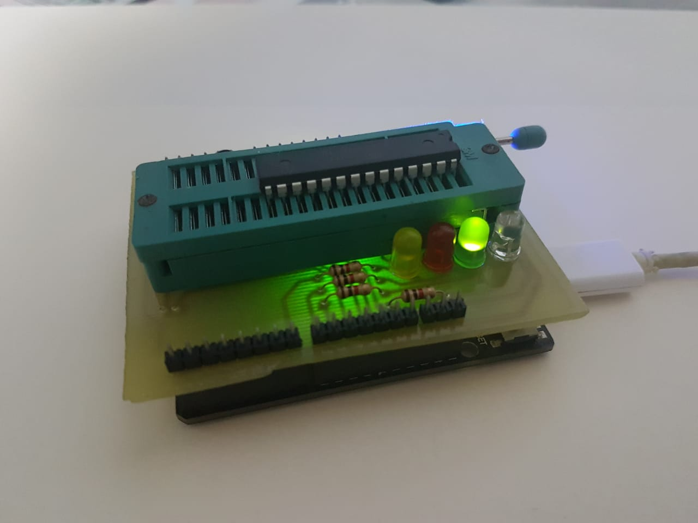
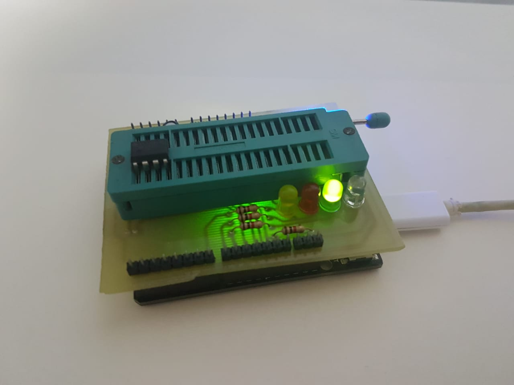

3.1 - Instalando os Drivers

  Para a utilização do gravador é necessario o reconhecimento da placa arduino base pelo computador. Para isso é necessário a instalação dos driver de comunicação da placa.
  Se você está utilizando um arduino original ou com chip baseado em at2mega os drivers necessarios já são baixados junto com a ide do arduino.
  Se você esta utilizando um arduino compativel com algum driver não reconhecido pelo computador, voce deve fazer a instalação do driver que é utilizado na sua placa. Por exemplo CH340 ou CP2012.
  
3.2 - Configurando Arduino como gravador
  A Configuração do arduino base como gravador é bem simples de ser feita. Selecione nas ferramentas seu arduino e em qual porta ele foi instalado. Após isso entre em Arquivos/Exemplos/Arduino ISP. Esse Schect contem um firmware que transforma o arduino em um gravador ISP que sera a base para gravar os microcontroladores externos. 
  Grave esse skecth no seu arduino e verifique se foi concluido com sucesso.
  Ao ligar o arduino com o shield gravador ou resetar uma placa ja ligada com o scketch que gravamos em cima. o comportamento dos leds indicadores seguirá este padrão.
  

Figura 03 - Comportamento ao ligar o gravador com o firmware já instalado no arduino base
  
  
3.3 - Gravando o bootloader no microncontrolador
  Agora que temos nosso arduino base configurado como gravador vamos configuralo como gravador. Para gravar o bootloader vc deve no menu ferramentas selecionar qual a placa compativel com o microcontrolador que vc deseja gravar por exemplo se for uma placa que utilize um atmega328 vc pode utilizar o bootloader para o arduino UNO. Se vc tem uma placa com base em um Franzininho um digispark que utiliza o microcontrolador Attiny85 vc pode utilizar o bootloader fornecido para o arduino gemma.
  
  Após escolher o tipo do seu microcontrolador que sera gravado, mantenha a mesma porta de comunicação e agora o mais importante. no item gravador ainda na aba Ferramentas selecione -> ARDUINO AS ISP. Escolhendo essa opção vc estará usando o arduino base como gravador.
  
  Sabendo qual o microcontrolador que ira gravar. Posicione no soquete ZIF o chip na posição correta indicada. Trave o soquete para realizar o contato elétrico entre o gravador e o microcontrolador desejado.
  

Figura 01 - Posicionamento de um Atmega328

Figura 02 - Posicionamento de um ATtiny85

  Após isso clique em Ferramentas/Gravar Bootloader
  
  Se você seguiu todos os passos verá uma mensagem de Gravação de bootloader Concluida 
